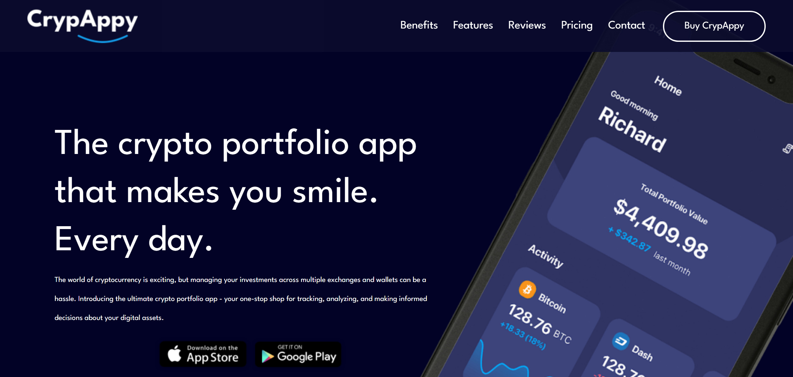
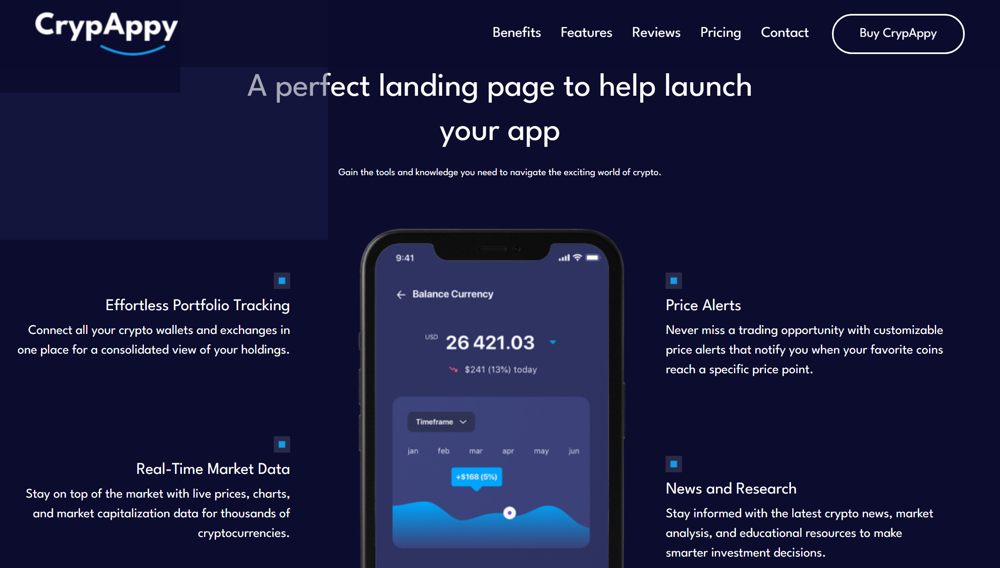
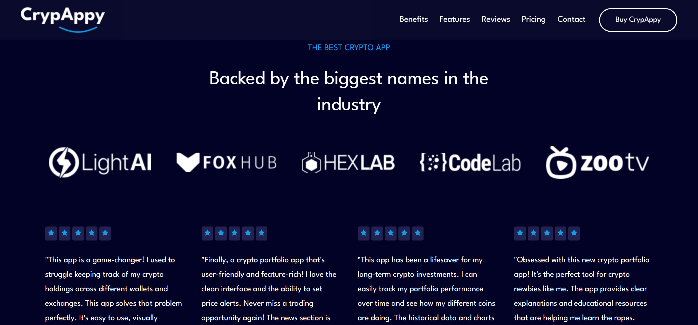

# CRYPAPPY website

The crypto portfolio app.

## Screenshots from the project

## How to run the project

1. Clone this project by using `https://github.com/DayVee-Programming/CrypAppy.git` on your command line or you can download it by pressing on "Code" button --> "Download ZIP"
2. Open the cloned project folder and open index.html file with your browser

## Find a bug?

If you found an issue or would like to suggest an improvement, please feel free to submit an issue using the issues tab above or submit a pull request with a fix. Additionally, you can contact me through my website - https://dayvee-programming.netlify.app/contact
