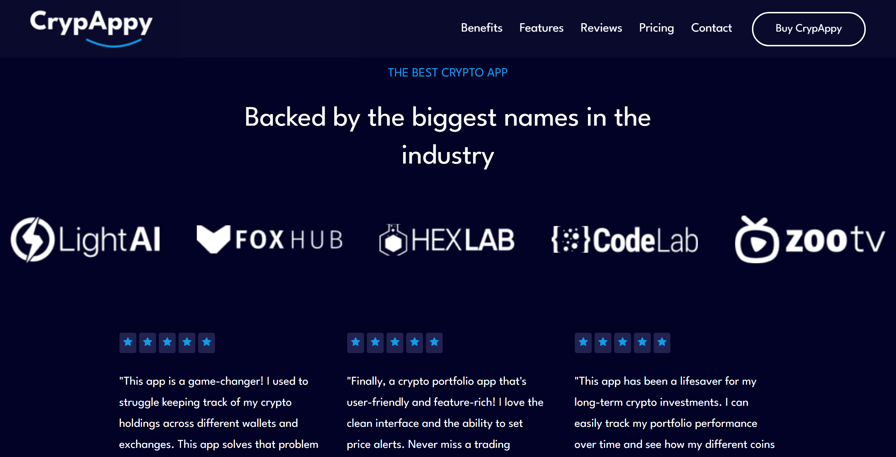

# CRYPAPPY website

Your all-in-one crypto companion. Buy, sell, trade, and manage your cryptocurrencies with ease.

## Screenshots from the project

## How to run the project

1. Clone this project by using `https://github.com/DayVee-Programming/CrypAppy.git` on your command line or you can download it by pressing on "Code" button --> "Download ZIP"
2. Open the cloned project folder with your editor and type npm run dev on your command line
3. Open it on your local server

## Find a bug?

If you found an issue or would like to suggest an improvement, please feel free to submit an issue using the issues tab above or submit a pull request with a fix. Additionally, you can contact me through my website - https://dayvee-programming.netlify.app/contact
